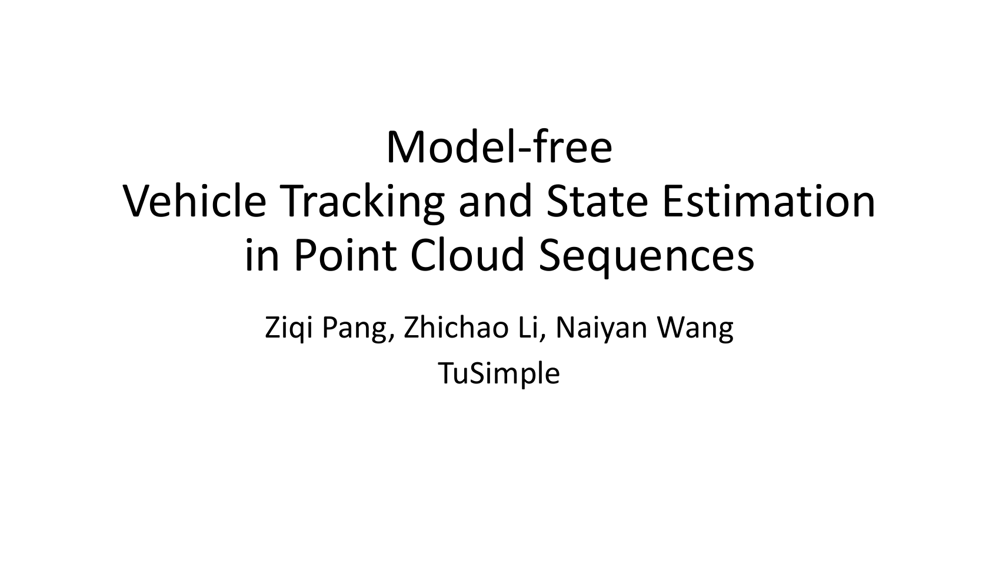

# Model-free Vehicle Tracking and State Estimation in Point Cloud Sequences

## 1. Introduction

This project is the repository for paper [Model-free Vehicle Tracking and State Estimation in Point Cloud Sequences](https://arxiv.org/abs/2103.06028). It concerns the single object tracking (SOT) of objects in point cloud sequences. The input to the algorithm are the starting location (in the form of a 3D bounding box) of an object and point cloud sequences. Our tracker then provides the bounding box on each subsequent point cloud frame, and get the dense shapes by aggregating the point clouds along with tracking. Furthermore, we explore its usages on other applications, such as simulating LiDAR scans for data augmentation.

**Please check our [youtube video](https://www.youtube.com/watch?v=BpHixKs91i8) below for a 1-minute introduction, and [this link](https://www.bilibili.com/video/BV1SX4y1V7nw/) to the bilibili version.**
[](https://www.youtube.com/watch?v=BpHixKs91i8)

This `README` file describes the most basic usages of this code base. For more details, please refer to:

* [Data Preprocessing](./docs/data_preprocessing.md): It describes the process for converting the raw data in Waymo dataset into more handy forms.
* [Benchmark](./docs/benchmark.md): It explains the process of selecting tracklets and construction of our benchmark. Note that the benchmark information is already in the `./benchmark/` and you may directly use it. The code for benchmark construction is for the purpose of verification.
* [Design](./docs/design.md): This documentation explains our design for the implementation. Reading this would be useful for understanding our tracker implementation and modifying it for your own purpose.
* [Model Configs](./docs/configs.md): We use the `config.yaml` to specify the behaviour of the tracker. Please refer to this documentation for detailed explanation. 
* [Toolkit](./docs/toolkit.md): Along this with project, we also provide several code snippets for visualizing the tracking results. This file discusses these toolkits we have created.

## 2. SOT API and Inference

### 2.1 Installation

Our code has been thoroughly tested using the environment of `python=3.6`. For more detailed dependencies, please refer to the `Environment` section below. 

We wrap the usages of our code into a library `sot_3d`, and the users may install it via the following command. The advantage of this installation command is that the behaviors of `sot_3d` will keep synchronized with your modifications.

```
pip install -e ./
```

### 2.2 Tracking API

The main API `tracker_api` of is in `main.py`. In the default case, it takes the model configuration, the beginning bounding box, and a data loader as input, output the tracking result as specified below. Some additional guidelines on this API are:

* `data_loader` is an iterator reading the data. On each iteration, it returns a dictionary, with the keys `pc` (point cloud) and `ego` (the transformation matrix to the world coordinate) as compulsory. An example of `data_loader` is in [example_loader](./data_loader/example_loader.py).
* When you want to compare the tracking results with the ground truth along with tracking, please provide the input argument `gts` and import the function `compare_to_gt`, the data type `sot_3d.data_protos.BBox` . The gts are a list of `BBox`.
* We also provide a handy tool for visualization. Please import `from sot_3d.visualization import Visualizer2D` and `frame_result_visualization` for a frame-level BEV visualization.

```Python
import sot_3d
from sot_3d.data_protos import BBox
from sot_3d.visualization import Visualizer2D


def tracker_api(configs, id, start_bbox, start_frame, data_loader, track_len, gts=None, visualize=False):
""" 
    Args:
        configs: model configuration read from config.yaml
        id (str): each tracklet has an id
        start_bbox ([x, y, z, yaw, l, w, h]): the beginning location of this id
        data_loader (an iterator): iterator returning data of each incoming frame
        track_len: number of frames in the tracklet
    Return:
        {
            frame_number0: {'bbox0': previous frame result, 'bbox1': current frame result, 'motion': estimated motion}
            frame_number1: ...
            ...
            frame_numberN: ...
        }
"""
```

### 2.3 Evaluation API

The API for evaluation is in `evaluation/evaluation.py`. `tracklet_acc` and `tracklet_rob` compute the accuracy and robustness given the ious in a tracklet, and `metrics_from_bboxes` deals with the cases when the inputs are raw bounding boxes. Note that the bounding boxes are in the format of `sot_3d.data_protos.BBox`.

```Python
def tracklet_acc(ious):
    ...
    """ the accuracy for a tracklet
    """

def tracklet_rob(ious, thresholds):
    ...
    """ compute the robustness of a tracklet
    """

def metrics_from_bboxes(pred_bboxes, gts):
    ...
    """ Compute the accuracy and robustness of a tracklet
    Args:
        pred_bboxes (list of BBox)
        gts (list of BBox)
    Return:
        accuracy, robustness, length of tracklet
    """
```

## 3 Building Up the Benchmark

Our `LiDAR-SOT` benchmark selects 1172 tracklets from the validation set of Waymo Open Dataset. These tracklets satisfy the requirements of mobility, length, and meaningful initialization.

The information of selected tracklets is in the `./benchmark/`. Each `json` file stores the ids, segment names, and the frame intervals for each selected tracklet. For replicating the construction of this benchmark, please refer to [this documentation](./docs/benchmark.md). 

## 4. Steps for Inference/Evaluation on the Benchmark

### 4.1 Data Preparation

Please follow the guidelines in [Data Preprocessing](./docs/data_preprocessing.md). Suppose your root directory is `DATA_ROOT`.

### 4.2 Running on the benchmark

The command for running on the inference is as follows. Note that there are also some other arguments, please refer to the `main.py` for more details.

```bash
python main.py \
    --name NAME \                         # The NAME for your experiment.
    --bench_list your_tracklet_list \     # The path for your benchmark tracklets. By default at ./benchmark/bench_list.json.
    --data_folder DATA_ROOT \             # The location to store your datasets.
    --result_folder result_folder \       # Where you store the results of each tracklet.
    --process process_number \            # Use mutiple processes to split the dataset and accelerate inference.
```

After this, you may access the result for tracklet `ID` as demonstrated below. Inside the json files, `bbox0` and `bbox1` indicates the estimated bounding boxes in frame `frame_index - 1` and `frame_index`.

``` 
-- result_folder
   -- NAME
       -- summary
           -- ID.json
               {
                   frame_index0: {'bbox0': ..., 'bbox1': ..., 'motion': ..., 
                                  'gt_bbox0': ..., 'gt_bbox1': ..., 'gt_motion': ..., 
                                  'iou2d': ..., 'iou3d': ...}
                   frame_index1: ...
                   frame_indexN: ...
               }
```

### 4.3 Evaluation

For computing the accuracy and robustness of tracklets, use the following code:

```bash
cd evaluation
python evaluation.py \
    --name NAME \                                 # the name of the experiment
    --result_folder result_folder \               # result folder
    --data_folder DATA_ROOT \                     # root directory storing the dataset
    --bench_list_folder benchmark_list_folder \   # directory for benchmark tracklet information, by default the ./benchmark/
    --iou                                         # use this if already computes the iou during inference
```

For the evaluation of shapes, use the following code:

```bash
cd evaluation
python evaluation.py \
    --name NAME \                                 # the name of the experiment
    --result_folder result_folder \               # result folder
    --data_folder DATA_ROOT \                     # root directory storing the dataset
    --bench_list_folder benchmark_list_folder \   # directory for benchmark tracklet information, by default the ./benchmark/
    --process process_number                      # Use mutiple processes to split the dataset and accelerate evaluation.
```

## 5. Environment

This repository has been tested and run using `python=3.6`.

For inference on the dataset using our tracker, the following libraries are compulsory:
```
numpy, scikit-learn, numba, scipy
```

If the evaluation with ground-truth is involved, please install the `shapely` library for the computation of iou.
```
shapely (for iou computation)
```

The data preprocessing on Waymo needs.
```
waymo_open_dataset
```

Our visualization toolkit needs.
```
matplotlib, open3d, pangolin
```

## 6. Citation

If you find our paper or repository useful, please consider citing

```tex
@article{pang2021model,
    title={Model-free Vehicle Tracking and State Estimation in Point Cloud Sequences},
    author={Pang, Ziqi and Li, Zhichao and Wang, Naiyan},
    journal={arXiv preprint arXiv:2103.06028},
    year={2021}
}
```
